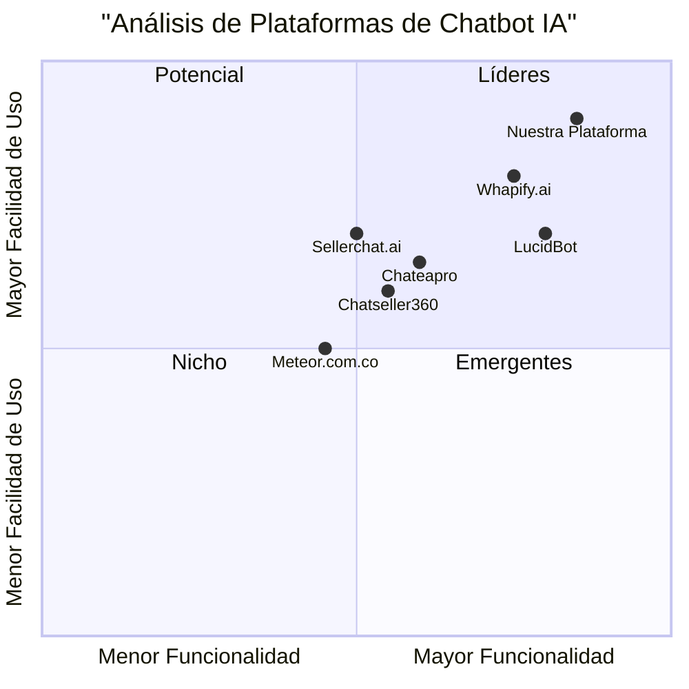

# PRD: Plataforma de Agentes IA para Servicio al Cliente y Ventas

## 1. Información del Proyecto
- **Nombre del Proyecto**: ai_customer_service_platform
- **Fecha**: 24 de Mayo, 2025
- **Requisitos Originales**: Crear una plataforma de agentes de IA para servicio al cliente y ventas, multiplataforma, fácil de implementar en WordPress y otros desarrollos.

## 2. Definición del Producto

### 2.1 Objetivos del Producto
1. Desarrollar una plataforma omnicanal de agentes IA que optimice la atención al cliente y las ventas con una implementación simple
2. Proporcionar integraciones nativas con los CMS más populares y flexibilidad para cualquier desarrollo
3. Ofrecer una solución competitiva en el mercado latinoamericano con características superiores a la competencia

### 2.2 Historias de Usuario
1. Como propietario de una tienda en línea, quiero integrar fácilmente el chatbot en mi sitio WordPress para automatizar la atención al cliente 24/7
2. Como gerente de ventas, quiero tener análisis detallados del rendimiento de los agentes IA para optimizar las conversiones
3. Como administrador del sistema, quiero poder personalizar los flujos de conversación y entrenar al agente IA sin conocimientos técnicos
4. Como cliente, quiero obtener respuestas inmediatas y precisas a mis consultas en cualquier canal de comunicación

### 2.3 Análisis Competitivo

#### LucidBot
**Pros:**
- Integración omnicanal robusta
- Funcionalidades específicas para eCommerce
- Integraciones con plataformas populares

**Contras:**
- Precio relativamente alto
- Límite de contactos restrictivo

#### Whapify.ai
**Pros:**
- IA Emocional avanzada
- Integración con múltiples motores de IA
- Partner oficial de Meta

**Contras:**
- Enfoque principalmente en WhatsApp
- Período de prueba limitado

#### Competidores Adicionales
- Chateapro
- Chatseller360
- Sellerchat.ai
- Meteor.com.co

### 2.4 Análisis Competitivo (Cuadrante)



## 3. Especificaciones Técnicas

### 3.1 Análisis de Requisitos
- Arquitectura multiplataforma y escalable
- Integración nativa con WordPress y otros CMS
- Sistema de IA multimodelo con capacidad de aprendizaje continuo
- API RESTful para integraciones personalizadas
- Sistema de análisis y reportes en tiempo real

### 3.2 Pool de Requisitos

#### P0 (Debe tener)
- Integración con WordPress mediante plugin nativo
- Soporte para WhatsApp Business API
- Panel de administración intuitivo
- Sistema de entrenamiento de IA sin código
- Análisis de conversaciones y métricas básicas
- Automatización de respuestas 24/7

#### P1 (Debería tener)
- Integración con Facebook Messenger e Instagram
- Sistema de plantillas de conversación
- Análisis avanzado de sentimientos
- Integración con CRM populares
- Sistema de reglas de negocio personalizables

#### P2 (Sería bueno tener)
- Reconocimiento de voz y audio
- Integración con sistemas de pago
- Chatbot con avatar personalizado
- Soporte para múltiples idiomas
- Sistema de gamificación para agentes humanos

### 3.3 Diseño de UI

#### Panel Principal
```
+----------------------------------+
|  Logo    Búsqueda      Perfil    |
+----------------------------------+
|        |                         |
| Menú   |     Dashboard           |
| Lateral |    - Métricas          |
|        |    - Conversaciones     |
|        |    - Análisis           |
|        |                         |
+----------------------------------+
```

### 3.4 Preguntas Abiertas
1. ¿Qué motores de IA específicos se integrarán además de los estándar?
2. ¿Se implementará un sistema de pagos propio o se utilizarán integraciones existentes?
3. ¿Qué nivel de personalización se permitirá en el modelo de IA base?
4. ¿Cómo se manejarán los datos sensibles de los clientes en diferentes regiones?

## 4. Métricas de Éxito
- Tasa de implementación exitosa > 95%
- Tiempo de implementación < 30 minutos
- Satisfacción del usuario final > 85%
- Tasa de resolución automatizada > 70%
- Tiempo de respuesta < 2 segundos

## 5. Cronograma Sugerido
- Fase 1 (3 meses): Desarrollo del core y plugin WordPress
- Fase 2 (2 meses): Integraciones con WhatsApp y otras plataformas
- Fase 3 (2 meses): Sistema de análisis y reportes
- Fase 4 (1 mes): Pruebas y optimización

## 6. Consideraciones Adicionales
- Cumplimiento con GDPR y LGPD
- Escalabilidad para manejar múltiples clientes
- Soporte técnico 24/7
- Documentación multilenguaje
- Plan de contingencia para caídas del servicio